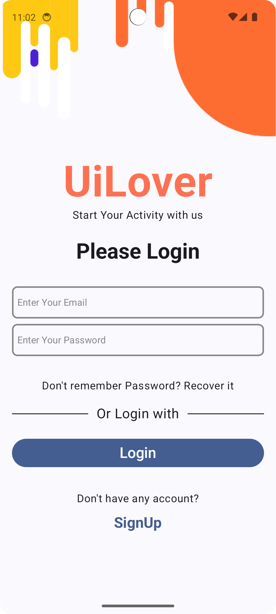

# Try APK
https://drive.google.com/file/d/1PnhQX9VwsHZwUDNWTiRPpSR_spKpt-E9/view?usp=sharing

# Screens

## Screen 1

## Screen 2
Login Email: `user1@example.com` 
Login Password: `password1` 

## Screen 3

